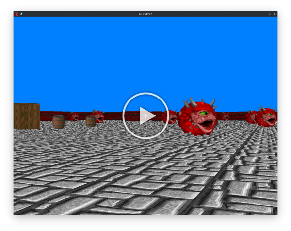

I found the YouTube channel of [OneLoneCoder](https://www.youtube.com/channel/UC-yuWVUplUJZvieEligKBkA), especially a video about building a First Person Shooter (*FPS*[^fps]) from scratch. The video was really interesting, and at the end of it, I had a working *FPS* using *SFML*[^sfml]. But I was lacking frame per seconds. So I improved it. And then, I realized that I was displaying on a really small window (200x200), so I extended it. And I added enemies. And so on and so forth...

In this post, I am sharing my experiment (and my code) for the curious.

## Technologies used

I used the *SFML* to open a window, display the frames, and handle events. When it was time, I used it to load textures -- but I finally used the `libpng`[^libpng] instead. I ended up trying to remove the *SFML* from the raycasting as much as possible, in order to allow bigger changes in the future (like *OpenGL*[^opengl] or *Vulkan*[^vulkan] calls)

## The Magic

In order to display something, we need to cast rays. Each screen column is the result of one ray. By doing so, we get the distance between the player and the walls, allowing us to split the column into three parts (sky, wall, ground), and texture then accordingly.

### The DDA algorithm

<iframe width="560" height="315" src="https://www.youtube.com/embed//NbSee-XM7WA" frameborder="0" allow="accelerometer; autoplay; encrypted-media; gyroscope; picture-in-picture" allowfullscreen>
</iframe>

You really should watch this guy :)

### Parallelisation

Because the Raycasting is running on the CPU, if it is simple-threaded, it can be very slow, so I needed to add some parallel computations in the mix.
Since I was in modern C++ (*cpp20*[^cpp20]), I could use the `std::async` and `std::future` classes. It allows me to do asyncronous operations. But the standard library does not include an *async executor* (as of March 2021), so I made a `ThreadPool` class to execute async functions. This threadPool ended up being very useful even for non-rendering processes : like collision computation and entity updating.

### Optimisation

The rendering code need to run quick, in order to maintain 60 frames per seconds. My first optimization attempts was therefore leaving **g++**[^g] for **clang++**[^clang] (+ ~10fps) and enabling for speed focused compiler optimization (+ ~2fps). Then I wandered into the code, passing references as much as possible, exited loops early, reducing function calls, inlined lots of them, etc. This was really interesting, because it allowed me to dive into the C++ runtime behaviour and I learned new/better ways to do things, like:

- Avoid using `operator+` on complex type, and prefer the `operator +=`
- Limit the amount of local variables to fit with cpu registers capacities
- etc..

The subject is really complex and deep but very fascinating.

## The Future

I want to use *Vulkan* to make use of graphics cards in order to do the rendering.

I also want to use *BSP* (Binary Space Partitioning) to render the space, just like the first Doon used.

I would like to improved my threadPool to allow  having futures inside futures.

For now, a working code + building instructions are available on GitHub[^raycaster].

## References

[^fps]: First Person Shooter
[^sfml]: [Simple and Fast Multimedia Library](https://www.sfml-dev.org/index-fr.php)
[^libpng]: [Official PNG library](http://libpng.org/pub/png/libpng.html)
[^cpp20]: [C++ 20 Reference](https://en.cppreference.com/w/cpp/20)
[^g]: [C++ Compiler by the GNU Project](https://gcc.gnu.org/)
[^clang]: [C Family languages Compiler](https://clang.llvm.org/index.html), developped by the [LLVM project](https://www.llvm.org/)
[^opengl]: [High Performance Graphics Open Library](https://www.opengl.org/about/)
[^vulkan]: [Cross Platform Graphics Library](https://www.vulkan.org/)
[^raycaster]: My 3D raycaster [https://github.com/Epitech-Lyon/doon](https://github.com/Epitech-Lyon/doon)
