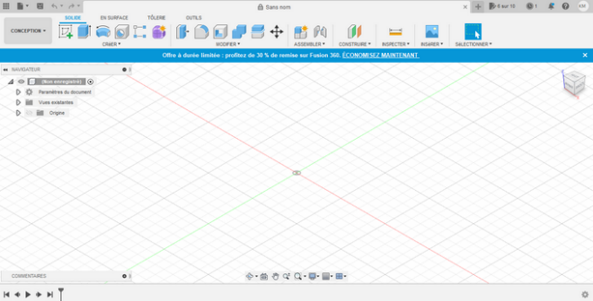
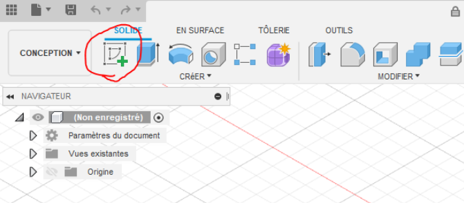
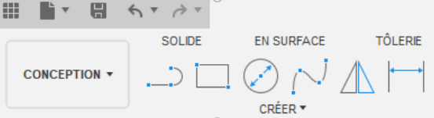
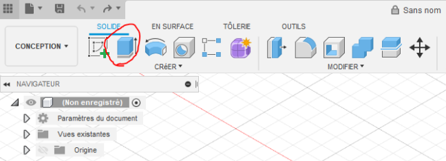

Pendant ma formation à Epitech cette année, j'ai eu l'occasion de proposer un workshop sur la modélisation `3D` -- un sujet qui me passionne.

Les workshops sont des activités où les étudiants préparent des exercices pour leurs camarades. Les exercices sont validés par nos accompagnateurs pour s'asssurer de la qualité du contenu et de la pertinence pour les étudiants.

Les workshops nous permettent -- à nous les étudiants -- de prendre du recul et de mieux comprendre les technologies que nous utilisons.

# Prérequis

Pendant toute la durée de ce Workshop vous aurez besoin d’un seul logiciel :
- [Fusion 360][1] 

Et bien évidemment d’un OS compatible avec [Fusion 360][1] (Windows 10, Linux et MacOs). 

# La modélisation `3D` c’est quoi ?

La modélisation `3D` est la création tridimensionnelle virtuelle d’un objet physique via l’utilisation d’un logiciel spécifique comme Fusion 360 ou Sketch’up. C’est donc avec le bon logiciel que vous pourrez faire plus facilement vos plus belles créations.

> La modélisation `3D` est la création tridimensionnelle virtuelle d’un objet physique via l’utilisation d’un logiciel spécifique comme Fusion 360 ou Sketch’up

# Les différents logiciels disponibles

Voici plusieurs logiciels qui permettent de modéliser en 3D, ils ont chacun leurs avantages et leurs inconvenient. 

- Fusion 360 
- Sketch’up 
- AUTOCAD 
- Blender 

En exemple Sketch’up est beaucoup plus utile à des fins de création de plan d’architecture et Fusion 360 est très bien conçu pour de la création d’objet 3D.

# Les avantages de la modélisation

On recourt a la modélisation `3D` dans de nombreux secteurs :
- réalité virtuelle
- jeux-vidéo
- impression 3D
- marketing
- images pour la télévision et le cinéma
- imagerie scientifique et médicale
- conception et fabrication assistée par ordinateur, etc.

La modélisation touche donc à tous les domaines. 

# Fusion 360 comment ca marche ?

[Fusion 360][1] propose six espaces de travail et vous pouvez passer de l'un à l'autre. Chacun dispose de son propre ensemble d'outils et de fonctions :

- **Design** (*Conception*) : Permet de dessiner des modèles et des surfaces en `3D` en utilisant les outils esquisses, extrusions, rotations et de nombreux autres outils standard en CAO.  
- **Render** (*Rendu de présentation*) : Génère des rendus photoréalistes des composants et des produits. Animation:  Anime des assemblages pour vérifier qu'ils fonctionnent comme prévu ou pour montrer leurs fonctionnalités à des prospects.
- **Simulation** : Des analyses de contraintes sont réalisées par ingénierie assistée par ordinateur au niveau de la conception pour s'assurer de la résistance aux conditions de fonctionnement.
- **Manufacture** (*Fabrication*) : La fabrication assistée par ordinateur (FAO) fournit une aide à la fabrication sur diverses machines outils numériques, comme les fraiseuses et les tours CNC, les dispositifs à découpe laser ou par jet d'eau.
- **Drawing** (*Dessin technique*) : Réalisation de dessins techniques pour la fabrication dans un atelier de machines manuelles traditionnelles ou pour accompagner les codes G (fonctions préparatoires) pour des pièces usinées sur des machines CNC.

L'espace de travail de [Fusion 360][1] est divisé en sept sections principales : 
- *barre d'outils*,
- *barre d'applications*,
- *navigation*,
- *timeline*,
- *navigateur*,
- *cube vues*
- *menu radial*

# Installation de Fusion 360

Pour commencer l’installation, il faut donc se rendre sur [le site internet de AutoDesk Fusion 360][1]. Cliquez sur [Version d’évaluation gratuite de Fusion 360][2] et suivez l’assistant de création de compte AutoDesk... Après ces étapes effectuées, vous aurez donc le téléchargement du logiciel qui va se lancer automatiquement. 

Maintenant, il faut découvrir comment fonctionne le logiciel [Fusion 360][1]. 

# Découverte de l'interface graphique



## Exercice 1: les premiers pas dans la modélisation

Pour commencer nous allons faire des formes simples pour bien comprendre comment fonctionne [Fusion 360][1]. 

La première étape consiste à faire les 4 formes géométriques différentes (carré, rond, losange, rectangle) avec des angles non-droit. 

Pour créer ces formes, il faut donc : 
- aller dans *créer une esquisse* (voir Image 1)
- choisir la face pour créer l’objet, choisir la forme que vous voulez (voir Image 2)
- et ensuite extruder[^1] (voir Image 3) la forme souhaiter pour créer un objet en `3D`. 

Image 1:



Image 2:



Image 3:



## Exercice 2: ma première création

Voila ! Vous êtes prêt à faire votre première création ! 

Vous devez créer un pot pour une plante qui fait `15 cm` de haut et `8 cm` de radius, pour le reste votre imagination fera le reste ! 

**Allez plus loin...**

À partir de maintenant vous avez toutes les clés en main pour pouvoir créer vos propres objets ou structures en `3D` ! Il vous manque une chose... exposer votre modèle !

## Exercice 3 : l’implémentation en HTML

Après avoir créé votre objet, si vous souhaitez le montrer dans un portfolio ou une boutique en ligne un composant `HTML` existe pour vous faciliter la tâche ! 

Ce composant s’appelle `<model-viewer>` il est très simple d’utilisation ! 

Vous avez en premier lieu le script a ajouter sur votre code :

```html
<script type="module" src="url de votre model"></script>
```

Et en second, ajouter le composant : 

```html
<model-viewer 
    src="shared-assets/models/Astronaut.glb"
    alt="A 3D model of an astronaut"
    ar-modes="webxr scene-viewer quick-look"
    environment-image="neutral"
    auto-rotate camera-controls>
</model-viewer> 
```

## Conclusion

Vous savez maintenant faire vos propres modèles `3D` et vous savez aussi comment l’implémenter directement sur votre site, il ne vous reste plus qu’à faire ce que vous souhaitez avec vos connaissances ! 


[1]: https://www.autodesk.fr/products/fusion-360/
[2]: https://www.autodesk.fr/products/fusion-360/free-trial
[^1]: Etirer une forme de la `2D` vers la `3D`.
