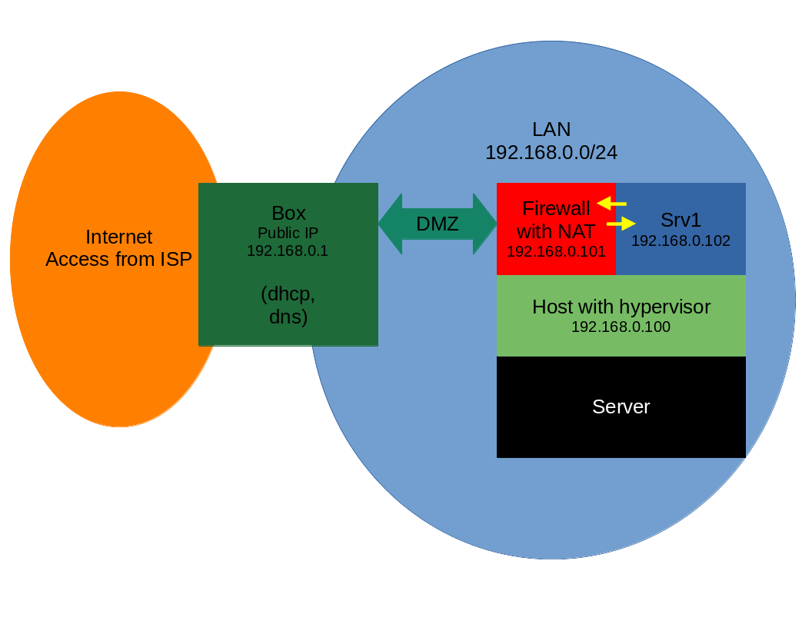

Durant mon temps libre, j'ai eu besoin de mettre en place des machines linux pour différentes raisons :   
 * Faire des essais de nouvelles technologies pour ma satisfaction personnelle.   
 * Exposer des services qui me sont utiles (serveur web, serveur de jeu, *VPN*[^vpn], stockage de fichier, etc)   
 * Avoir un environnement de test pour ensuite déployer des services chez d'autres personnes.   
   
À mes débuts, je ne pouvais pas juste louer un serveur pour des raisons de moyens de paiement. Du coup, passionné, je récupérais du matériel (et je continue).   
   
Je prenais donc un vieil ordinateur récupéré et remis en état, le reformatais pour ensuite installer un *OS*[^OS]. et faire mes tests. Mais au fur et à mesure du temps j'ai trouvé cette "logistique" fatigante :   
 * Chercher une machine   
 * Vérifier le fonctionnement et la compatibilité des composants   
 * Chercher un écran   
 * Un clavier   
 * Tendre un câble *ethernet*   
 * Réinstaller un *OS*   
 * Installer et configurer l'*OS* et les services dessus   
   
Aussi en cas de besoin d'exposer plusieurs services je n'avais pas envie de tout mettre sur un même serveur, sans rien diviser pour des raisons de sécurité, parmi d'autres.   
   
Seulement n'ayant pas un énorme *switch*[^switch] -- ni de câbles *ethernet*, ni beaucoup de prises électriques, ni une volonté de consommer beaucoup trop de courant -- maintenir en fonctionnement beaucoup de matériels de récupération, anciens, pas forcément le plus fiable, n'était pas une option.   
   
Me retrouvant limité, j'ai pensé à plusieurs solutions : la virtualisation et les containers. J'ai opté pour les deux solutions à des niveaux différents, comme nous le verrons par la suite.   
   
## Architecture

Donc voici les spécifications de la machine de récupération utilisée que j'avais sous la main :   
 * *CPU*[^cpu] : `Athlon II x2 255 3.1GHz` de `2010`   
 * *RAM*[^ram] : `8GB`   
 * Carte Réseau : gigabit *ethernet*[^ethernet] intégrée à la carte mère   
 * Stockage : *HDD*[^hdd] de `512GB`.   
   
Ce n'est pas très puissant, mais je n'avais pas besoin de beaucoup de puissance et surtout, c'est ce que j'avais sous la main. Mais si vous souhaitez le refaire, avec du meilleur matériel c'est parfait. Vérifiez toujours que votre *CPU* supporte la virtualisation et qu'elle est activée dans le *bios*[^bios].   
   
Voici donc comment j'ai architecturé mon projet :   
   
   
Au départ je souhaitais me servir des services de ma *box*[^box] comme le [NAT](https://en.wikipedia.org/wiki/Network_address_translation), le *firewall*[^firewall] intégré, etc. J'ai donc configuré l'hôte pour que les machines virtuelles soient sur le réseau local, pour expérimenter et faire mes services privés (envies de domotique dans le futur) accessibles en *LAN*[^lan].

L'idée était donc de me servir du *NAT*[^nat] de la *box* pour les rares services exposés.   
   
Sauf que ma *box* actuelle est si mauvaise qu'elle arrive pas à enregistrer les paramètres *nat* entre autres. Heureusement la fonctionnalité [DMZ](https://en.wikipedia.org/wiki/DMZ_(computing)) "marche", enfin comme le font certains [ISP](https://en.wikipedia.org/wiki/Internet_service_provider) avec leur *box*, pas une vraie *DMZ* avec un second sous réseau, ni même un *vlan*[^vlan], mais juste refiler tout le trafic à une machine du réseau locale.  Une vraie passoire si la machine exposée n'a pas un *firewall* bien configuré.   
   
Comme on peut le voir sur l'image j'ai donc mis une machine virtuelle dédiée au *firewall* et c'est elle qui est en front (sur l'extérieur) avec un *firewall* et qui fait les bonnes redirections vers les autres machines virtuelles du *LAN* qui leur permettrons d'exposer leurs services. En fait c'est du *NAT* également.   
   
Cette architecture possède des défauts que j'exposerai de façon non exhaustive à la fin de cet article. Je parlerai également de ce que je souhaite changer ou améliorer.   
   
## Choix du système hôte

J'ai donc eu besoin d'un hyperviseur[^hyperviseur]. Étant assez porté sur l'OpenSource j'ai écarté [VMWare](https://www.vmware.com/fr/products/workstation-pro.html). Par ailleurs je ne suis même pas sûr que mon matériel l'aurait supporté. J'ai fini par chercher une solution faite sur une distribution linux.

[Proxmox](https://www.proxmox.com/en/proxmox-ve) est vraiment une solution pratique, mais j'avais aussi envie de tout faire par moi-même. J'avais certes un besoin, mais aussi une envie d'apprendre des choses.

J'ai fini par choisir [centos 8](http://isoredirect.centos.org/centos/8/isos/x86_64/) dont l'annonce du raccourcissement de sa durée de vie n'avait pas encore été faite au moment où j'ai monté ce serveur. Je compte m'occuper de ce problème, comme vous le verrez à la fin avec les améliorations à venir.   
   
Du coup voici les raisons pour lesquelles j'avais choisis  *centos* :  
 * Clone de [RHEL](https://en.wikipedia.org/wiki/Red_Hat_Enterprise_Linux)   
 * Stabilité   
 * Fiabilité   
 * Support 10 ans avec mises à jour de sécurités régulières   
 * Groupes de paquets, fonctionnalité équivalente aux méta-paquets debian   
 * Documentation [redhat](https://www.redhat.com/en) parfaitement adaptée.   
   
Pour la virtualisation, j'ai donc choisi [qemu-kvm](https://www.qemu.org/) avec [libvirt](https://www.libvirt.org/index.html). C'est performant, c'est très utilisé, parmi les mieux intégrés à linux, et cette solution étant conseillée et détaillée dans la documentation *redhat*, c'est un plus.   
   
## Configuration de l'hôte

Dans un premier temps, nous devons installer la solution de virtualisation. Si vous installez *centos* spécifiquement pour ça, vous pouvez selectionner le groupe de virtualisation dans la selection des paquets à installer. Si vous avez déjà installé  *centos*, vous pouvez installer le groupe de virtualisation avec

```sh   
dnf groupinstall "Virtualization Host"   
```

Ça installe *libvirt*, *qemu*, et tous les outils dont nous aurons besoin.   
J'ai également installé [ovmf](https://wiki.ubuntu.com/UEFI/OVMF) pour pouvoir faire des vm en *uefi*[^uefi].

```sh   
dnf install edk2-ovmf   
```

Ensuite, normalement [*tuned-adm*](https://access.redhat.com/documentation/en-us/red_hat_enterprise_linux/7/html/performance_tuning_guide/chap-red_hat_enterprise_linux-performance_tuning_guide-tuned) est préinstallé sur  *centos*, sinon vous pouvez l'installer avec

```sh   
dnf install tuned && systemctl enable --now tuned   
```

Enfin selectionnant le profil de performance dédié à la virtualisation avec

```sh   
tuned-adm profile virtual-host && tuned-adm active   
```   
   
Pour être sur que le service *libvirt* est activé, nous allons activer et lancer le service

```sh   
systemctl enable --now libvirtd   
```   
   
Ensuite nous allons configurer le réseau de l'hôte.  Pour que les machines virtuelles soient sur le *LAN*, nous allons créer un *bridge*[^bridge] virtuel.  Pour ça il y a deux méthodes, la méthode avec le xml de *libvirt*, et la méthode externe. Pour ma part, j'ai choisis la méthode externe que voici. Avec [networkmanager](https://doc.ubuntu-fr.org/network-manager) et en particulier, *nmcli*, j'ai donc créé un bridge virtuel :

```sh   
nmcli con add ifname br0 type bridge con-name br0
```

Et ensuite pour que mon hôte puisse après coup être considéré comme connecté au bridge pour pouvoir avoir accès à internet par la même interface, je passe l'interface hôte, ici eth0[^eth0], en *slave*[^slave] de ce *bridge* :

```sh   
nmcli con add type bridge-slave ifname eth0 master br0
```

Enfin, avoir une addresse ip statique pour la connection à l'hôte est quand même très pratique, du coup, pour l'*ipv4*[^ipv4] :

```sh   
nmcli con mod br0 ipv4.addresses 192.168.0.100/24
nmcli con mod br0 ipv4.gateway 192.168.0.1
nmcli con mod br0 ipv4.method manual
```

Vous pouvez faire la même chose pour l'*ipv6*[^ipv6], pour ma part, ma *box* ne supporte pas l'*ipv6*. Enfin nous pouvons activer cette interface :

```sh   
nmcli con up br0
```   
   
Enfin nous allons configurer le *firewall* de l'hôte. Étant sous  *centos*, avec [*firewalld*](https://firewalld.org/) d'installé, c'est plutôt simple et fiable de suivre le principe des zones. Vous pouvez lister les zones et leurs détails avec :

```sh   
firewall-cmd --list-all-zones
```

N'ayant besoin que du *ssh*[^ssh], la zone publique me convenait, et j'ai donc choisi public comme zone par défaut. La zone *libvirt* convient aussi.

```sh   
firewall-cmd --set-default-zone=public
```

Vous pouvez aussi spécifier la donne que vous souhaitez par interface, et également modifier ou ajouter des zones custom, et ajouter des règles. En fait *firewalld* est un frontend simplifié de nftables, un *firewall* très utilisé sous linux. Ici je n'en parlerais pas plus car ce n'est pas la cible de cet article. Normalement, maintenant, nous avons une  *centos* prête à hoster des vm.   
   
## Firewall et DMZ

Nous allons maintenant monter la machine virtuelle qui va me servir de *firewall*. J'ai choisi *alpine linux*[^alpine-linux] pour sa légèreté, sa sécurité et sa faible consommation de ressources. J'ai donc téléchargé la dernière *iso*[^iso] sur le site officiel de *alpine linux* sur le disque du serveur, et avec

```sh   
osinfo-query *OS*
```

J'ai pu récupérer le *short-id* de l'*OS* que je veux installer.   
Cela va me permettre de créer une machine virtuelle avec la commande suivante.

```sh   
virt-install --boot uefi --machine q35 --name fw-1 --memory 128 --vcpus 1 --disk bus=virtio,size=16 --network bridge=br0,model=virtio --OS-variant alpinelinux3.13 --cdrom alpine-virt-3.13.5-x86_64.iso --graphics none
```

Cette commande est pour lancer la procédure d'installation dans un terminal, sans interface graphique, il est aussi possible de passer par du vnc[^vnc], pour des distributions avec installateurs graphiques. D'autres détails peuvent varier selon l'*OS* à virtualiser, et la façon de l'installer.

Par exemple ici j'ai choisis `128MB` de ram car j'ai pas besoin de beaucoup de ram pour la gestion du réseau, et que alpine fonctionne très bien avec `128MB`.   
Également ça me permet de garder la majorité de la ram restante pour mes services.  Aussi remarquer `bridge=br0`, pour que les machines virtuelles se connectent au *bridge* établi préalablement.   
   
Ensuite, j'ai lancé la procédure d'installation de alpine linux avec un serveur *openssh*[^openssh] et une ip fixe, ici `192.168.0.101`, puis je me suis connecté en *ssh*, car c'est plus pratique. La configuration du serveur *ssh* est hors de la portée de cet article.   
   
Pour que la machine virtuelle redémarre toute seule si l'*hyperviseur* redémarre :

```sh   
virsh autostart fw-1
```

La suite de l'article porte sur l'architecture pour des services publiques, créer des machines virtuelles **suffisent en LAN pour des services privés**. La suite de l'article est faite pour l'exposition de services externes. Les commandes suivantes se feront sur la machine virtuelle qui sera utilisée comme *firewall*.   
   
## Configuration basique du *firewall* sur la machine virtuelle   
Pour gérer le *firewall*, j'ai décidé d'utiliser [nftables](https://wiki.nftables.org/).   
Il a donc fallu l'installer.

```sh   
apk add nftables
```

Pour pouvoir le configurer il faut lancer le service. Ces étapes sont relativement "critiques", dans le sens où il y a un risque de s'enfermer dehors.   
   
C'est pourquoi dans un premier temps on va directement autoriser le *ssh* dès le lancement du service. La configuration alpine par default est plutôt bien faite avec les bonnes règles pour l'[ICMP](https://en.wikipedia.org/wiki/Internet_Control_Message_Protocol) (également cette conf par défault fait que si certes on n'autorise pas de nouvelles connections, les connections existantes comme celle utilisée pour la configuration n'est pas éjectée, donc on a la possibilité d'autoriser le *ssh*, pour éviter de s'enfermer dehors)

```sh   
rc-service nftables start
nft add rule inet filter input tcp dport 22 accept
```

Pour voir la configuration vous pouvez faire

```sh   
nft -a list ruleset
```

Tant que vous sauvegardez pas, relancer le service suffit à revenir aux paramètres précédents. Evidemment, il est possible d'enlever des règles facilement, mais cet article n'a pas vocation d'être une documentation de *nftables*. Quand vous sauvegardez soyez bien sûr que votre configuration ne vous enferme pas dehors. Pour sauvegarder :

```sh   
rc-service nftables save
```

Et enfin pour faire en sorte que le service puisse se relancer au redémarrage de la machine virtuelle.

```sh   
rc-update add nftables default
```   
   
## Configuration plus avancée du *firewall* sur la machine virtuelle

### IP forwarding   

Pour autoriser le *forwarding*[^forwarding], il faut le permettre au niveau du kernel, c'est possible via des réglages avec *sysctl*[^sysctl].   
Éditez /etc/sysctl.conf, et ajoutez à la fin

```sh   
# Pour l'ipv4
net.ipv4.ip_forward=1
# Pour l'ipv6
net.ipv6.conf.default.forwarding=1
net.ipv6.conf.all.forwarding=1
```

Et ensuite

```sh   
sysctl -p
```   
Pour vérifier que c'est bien appliqué, (par exemple pour l'*ipv4*) n'hésitez pas à faire

```sh   
sysctl net.ipv4.ip_forward
```   
Et a regarder si le retour est bien `1`.   
   
Maintenant nous allons activer le forwarding dans *nftables* en modifiant la chaine forwarding

```sh   
nft 'add chain inet filter forward { policy accept; }'
```   
   
### Mise en place du NAT   
Nous allons créer la tables et les chaînes du *NAT*.

```sh   
nft add table nat
nft 'add chain nat prerouting { type nat hook prerouting priority -100; }'
nft 'add chain nat postrouting { type nat hook postrouting priority 100; }'
```   
   
En *postrouting*, nous allons faire du [masquerading](https://en.wikipedia.org/wiki/Network_address_translation)

```sh   
nft add rule nat postrouting masquerade
```   
   
### Scénario d'exposition d'un service public   
   
Maintenant que nous avons notre *firewall* prêt, mettons que nous avons sur une machine du réseau local en `192.168.0.102` avec un serveur web à exposer en `80` et `443`.   
   
Le *prerouting* va permettre de rediriger le trafic avant de se frotter aux barrière de la chaine input   
Pour plus d'informations, voir la documentation *nftables* par rapport aux priorités.   
Pour cela on prend l'interface d'entrée du trafic, ici *eth0* et

```sh   
nft add rule nat prerouting iif "eth0" tcp dport 80 dnat to 192.168.0.102
nft add rule nat prerouting iif "eth0" tcp dport 443 dnat to 192.168.0.102
```   
Ça redirige tout le trafic qui arrive sur l'interface eth0 en tcp et sur les ports et `80` et `443`, vers la machine virtuelle hébergeant le serveur web qui lui répond au *firewall* qui va faire le masquerading pour pouvoir répondre à la requète à la vraie personne.   
   
Evidemment une fois toutes les actions faites ne pas oublier de sauvegarder la configuration

```sh   
rc-service nftables save
```   
   
### Configuration de la *box* pour la DMZ

Je ne peux pas vous aider la dessus car ça dépend des *box* et opérateurs, mais l'idée c'est de mettre la machine virtuelle faisant office de *firewall* (dans l'exemple ici, son ip était `192.168.0.101`) en *DMZ* via les paramètres de votre *box*.   
   
## Conclusion et améliorations à venir

Voici les principaux default de cette configuration :   
 * Tout est dans mon *LAN*, donc si un service se fait pirater, il a accès à tout le *LAN*.   
 * J'aurais besoin du contrôle de ma *box* pour faire une vraie *DMZ* isolée par vlan ou second réseau   
   
Voici des réflexions un peu fouillies que j'ai eu pour peut être venir à une meilleure solution:   
 * Je ne peux pas changer ma *box*, pour des raisons de résidences.   
 * Je souhaitais me servir des services de la *box* mais c'est une erreur vu sa médiocrité.   
 * Autre possibilité, configurer le bridge virtuel sur l'hôte pour faire un *vlan* (aucune idée pour le moment de comment m'y prendre), pour que les vm exposées n'aient le droit que de communiquer entre elle et avec le monde extérieur mais pas au reste du *LAN*.   
 * Ajouter une carte réseau pour conserver un bridge actuel pour les services du réseau local uniquement   
 * Faire du routage sur une seconde carte réseau vers un réseau de vms (aucune idée de comment m'y prendre)   
 * Faire un réseau entre les vm depuis la vm *firewall*, mais c'est pas trivial car c'est virtuel   
   
Je continue d'apprendre et tout n'est pas forcement juste, et serai heureux d'avoir des suggestions pertinentes par des personnes plus compétantes.   
Ce sont des sujets relativement compliqués en réseau si on est pas technicien réseau de formation.   
C'est loin d'être aussi trivial que ça puisse parraitre, en pratique, les fournisseurs cloud, de serveur et de vps, vous donnent des machines "déjà câblées".   
   
Mon envie à l'avenir avec ce serveur :   
 * Mettre un nouvel *OS* car le support de *centos* 8 a été raccourcis (*debian 11* ? *rocky linux 8* ?)   
 * Mieux repenser son architecture.   
 * M'améliorer en réseau grâce à ça.

## Références   

[^vpn]: VPN, Virtual Private Network
[^OS]: OS, Operating System
[^switch]: Switch, Commutateur réseau
[^lan]: LAN, Local Area Network
[^vlan]: VLAN, Virtual Local Area Network
[^box]: Box Internet
[^firewall]: Pare feu
[^hdd]: HDD, Hard Drive Disk
[^cpu]: CPU, Central Process Unit
[^ram]: RAM, Random Access Memory
[^nat]: NAT, Network Adress Transcripteur
[^hyperviseur]: Micrologiciel ou matériel qui crée et exécute machines virtuelles
[^bridge]: Passerelle entre deux réseaux informatiques
[^eth0]: ethernet
[^uefi]: Unified Extensible Firmware Interface
[^slave]: Slave
[^ipv4]: IPV4, Internet Protocol Version 4
[^ipv6]: IPV6, Internet Protocol Version 6
[^iso]: ISO, une image ISO est la représentation binaire exacte d'un CD ou DVD-ROM afin de la stocker sur votre disque dur en vue de la duplication ultérieure du média original
[^alpine-linux]: Alpine Linux
[^vnc]: VNC, Virtual Network Computing, système de visualisation et de contrôle de l'environnement de bureau d'un ordinateur distant.
[^openssh]: OpenSSH
[^forwarding]: Forwarding
[^sysctl]: sysctl
[^bios]: Basic Input Output System
[^ssh]: Secure Shell (SSH) est à la fois un programme informatique et un protocole de communication sécurisé