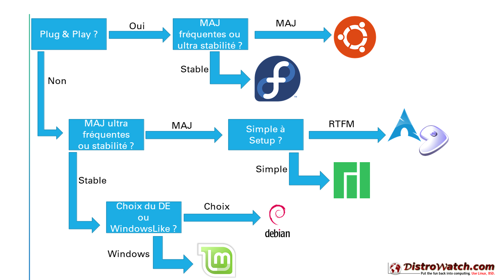

Durant notre parcours à Epitech, nous avons eu l'occasion de tester plusieurs distributions linux pour nos projets. C'est une expérience très enrichissante qui nous a permis de découvrir le hardware que nous utilisions chaque jour, et comprendre les rouages de l'informatique passée et moderne. Voici donc, selon nous, le classement des meilleures distributions linux *mainstream*, pour une utilisation quotidienne.

> A lire également, [Les meilleures DEs sur linux.](/top-linux-de)

## Distro #1 : [Ubuntu][4]

Première sortie le **20 octobre 2004** 
Créée et maintenue par la société [**CANONICAL**][5]

Elle est désormais la distribution linux la plus connue au monde pour sa simplicité d'utilisation. Elle répondra à tous les besoins basiques de l'utilisateur lambda. Deux versions sont traditionnellement disponibles : 
- une normale, mise à jour tous les 6 mois et
- une LTS (**L**ong **T**erm **S**upport) tous les 2 ans

| Les Plus  👍                |
|-----------------------------|
|Simple d'utilisation         |
|Complète pour tous les usages|
|Polyvalence                  |
|-----------------------------|

 

| Les Moins   👎                                 |
|------------------------------------------------|
| Envoi de données à Canonical activé par défaut |
| Gestion du réseau fastidieuse                  |
|------------------------------------------------|

 

> ### [Télécharger Ubuntu][4]

 

## Distro #2 : [Debian][7]

Première sortie le **16 août 1993** 
Créée par [**Ian Murdock**][6]

Debian est aujourd'hui la mère de milliers d'autres distributions. Elle est la mieux plébiscitée dans le monde des serveurs grâce à sa stabilité et ses performances.

| Les Plus  👍                |
|-----------------------------|
|Simple d'utilisation         |
|Légère et compacte           |
|Stabilité accrue             |
|Modulable                    |
|Setup complet et libre       |
|-----------------------------|

 

| Les Moins   👎                                      |
|-----------------------------------------------------|
| Deux gestionnaires de paquets créant une confusion  |
| Mauvaise gestion des drivers GPU Intel              |
| Pensée pour une utilisation Server et non Desktop   |
|-----------------------------------------------------|

 

> ### [Télécharger Debian][7]

 

## Distro #3 : [Arch Linux][1]

Première sortie en **Mars 2002** 
Crée par [**Judd Vinet**][8]

Distribution connue pour sa complexité d'installation et sa tendance à l'autodestruction. Elle est recommandée aux utilisateurs avancés de linux car son installation n'a rien d'automatique et laisse l'utilisateur livré à lui-même et ses manuels.

Elle est parfaite pour apprendre de fond en comble le fonctionnement de sa machine ainsi que de linux.

| Les Plus  👍                                                      |
|-------------------------------------------------------------------|
| Mises à jour instantanées                                         |
| Ultra Légère                                                      |
| Gestionnaire de paquets performant pour la gestion de dépendances |
| Communauté importante (AUR)                                       |
|-------------------------------------------------------------------|

 

| Les Moins   👎                                      |
|-----------------------------------------------------|
| Peu de sécurité                                     |
| Complexité d'installation                           |
| Mises à jour non testées                            |
|-----------------------------------------------------|

 

> ### [Télécharger Arch Linux][1]

 

## Distro #4 : [Fedora][3]

Première sortie en **2002** 
Crée par [**Red Hat**][2]

Distro fiable et complète, version desktop gratuite de RedHat Entreprise Linux. Elle est appréciée de ceux qui veulent un système ultra fiable, éloigné de tout bug primaire.

| Les Plus  👍                                                      |
|-------------------------------------------------------------------|
| Stabilité sur long terme                                          |
| Mises à jour des paquets fortement testées                        |
| Gestionnaire de paquets complet                                   |
|-------------------------------------------------------------------|

 

| Les Moins   👎                                      |
|-----------------------------------------------------|
| OS limité en performances et de taille importante   |
| Mises à jour longues et lourdes                     |
| Stabilité sur court terme                           |
|-----------------------------------------------------|

 

> ### [Télécharger Fedora][3]

 

## Comment trouver sa distro ?

Choisir sa distribution Linux peut être complexe. En réalité, le meilleur moyen reste d'essayer une distro qui nous intéresse -- dans une VM, sur une autre machine, en dual boot ou en live. Et puis l'avantage de Linux, c'est que la séparation des partitions vous permettra de changer de distro sans perdre un seul fichier et sans devoir tout recommencer.

Voici un résumé de questions simples à se poser pour faire son choix.

[][10]

Pour connaître d'avantage de distro, nous recommandons fortement de faire un tour sur [DistroWatch][9] -- ce site repertorie quasiment toutes les distro existantes.

# Conclusion

Voici un léger résumé sous forme de tableau des principales caractéristiques de chaque distro.

> Note : pour l'UX/UI, nous parlons ici des distro et non des Desktop Environments

<table border=1>
  <tr>
    <td> <i>critères</i> </td>
    <td><b>Ubuntu</b></td>
    <td><b>Debian</b></td>
    <td><b>Arch Linux</b></td>
    <td><b>Fedora</b></td>
  </tr>
  <tr>
    <td>Performance</td>
    <td>⭐</td>
    <td>⭐</td>
    <td>⭐⭐</td>
    <td>⭐</td>
  </tr>
  <tr>
    <td>Simplicité d'utilisation</td>
    <td>⭐⭐⭐</td>
    <td>⭐⭐</td>
    <td>⭐</td>
    <td>⭐⭐⭐</td>
  </tr>
  <tr>
    <td>Simplicité d'installation</td>
    <td>⭐⭐⭐</td>
    <td>⭐⭐</td>
    <td>⭐</td>
    <td>⭐⭐</td>
  </tr>
  <tr>
    <td>UX/UI</td>
    <td>⭐⭐⭐</td>
    <td>⭐</td>
    <td>⭐</td>
    <td>⭐</td>
  </tr>
  <tr>
    <td>Customisation</td>
    <td>⭐</td>
    <td>⭐⭐</td>
    <td>⭐⭐⭐</td>
    <td>⭐</td>
  </tr>
  <tr>
    <td>Compatibilité Matérielle</td>
    <td>⭐</td>
    <td>⭐⭐</td>
    <td>⭐⭐⭐</td>
    <td>⭐</td>
  </tr>
  <tr>
    <td>Stabilité</td>
    <td>⭐</td>
    <td>⭐⭐⭐</td>
    <td>⭐</td>
    <td>⭐</td>
  </tr>
</table>

 

# Références
- https://archlinux.org/download/
- https://fr.wikipedia.org/wiki/Red_Hat
- https://getfedora.org/fr/workstation/download/
- https://ubuntu.com/download/desktop
- https://canonical.com/
- https://fr.wikipedia.org/wiki/Ian_Murdock
- https://www.debian.org/CD/http-ftp/
- https://fr.wikipedia.org/wiki/Judd_Vinet
- https://distrowatch.com

[1]: https://archlinux.org/download/
[2]: https://fr.wikipedia.org/wiki/Red_Hat
[3]: https://getfedora.org/fr/workstation/download/
[4]: https://ubuntu.com/download/desktop
[5]: https://canonical.com/
[6]: https://fr.wikipedia.org/wiki/Ian_Murdock
[7]: https://www.debian.org/CD/http-ftp/
[8]: https://fr.wikipedia.org/wiki/Judd_Vinet
[9]: https://distrowatch.com
[10]: https://perrot.pt